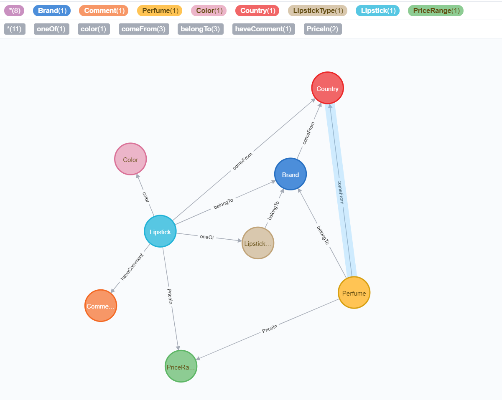

# CosmeticsKG
一个以化妆品为主题的知识图谱项目。目前包含3000节点，15000边，口红和香水两种品类。支持图谱检索、智能问答。

[点此查看项目Demo](http://60.205.227.226:8080/CosmeticsKG-Web/)
- 2023.2.46 应各位需求，现将相关资料打包：[百度云链接](https://pan.baidu.com/s/1MLivu-yKH7h0PVKsJBs2cw?pwd=fbx1)。Demo链接已失效，后续有时间考虑重新部署。

## 0.介绍
本项目是中国科学院大学（University of Chinese Academy of Sciences）2019年秋季学期自然语言处理课程小组作业成果。

本项目选取化妆品（以💄为主）为主题，构建该领域知识图谱；并基于图谱完成商品检索、图谱可视化和问答系统的任务。

由于缺少<问题，答案>训练数据集，目前大多数的小规模领域知识图谱都已基于规则的方法实现。
其中，使用最广泛的是模板匹配方法，即人工编写问题模板及对应的查询语句映射，然后根据问题的词语特征匹配模板，并根据一定规则转换为查询语句。

本项目提出了一个新的基于符号逻辑的问答方法，该方法立足句法分析层面，根据一定规则对问句的依存句法树进行剪枝，
得到能够一定程度上表示问句语义和查询意图的问题图，并通过解析器解析为查询语句进而完成答案生成。
该方法无需手工书写问题模板，大大节省了知识图谱问答系统的设计时间，并在本项目中取得了良好效果。
希望本方法能够为其他主题的领域知识图谱的问答系统提供一种基础的、简单的解决方案。

## 1.知识获取
数据来源主要包括化妆品官网（弃用）、美妆APP“心心”和电商网站京东。
官网和APP主要是获取正规的化妆品图片、信息、颜色数值等基本信息；
电商是为了获取价格和评论信息。

爬取APP数据使用了抓包软件Fiddler拦截手机向服务器发送的数据包来完成。
由于APP的请求参数包含加密token因此无法直接通过发送请求完成数据获取工作（技术大佬也可以尝试反编译APP获得token加密算法）。
电商数据使用Selenium爬取。
## 2.知识融合和处理
根据化妆品品牌和编号（色号）对多源数据进行匹配融合。
此外，我们使用K-Means算法对口红的颜色进行聚类分析，将所有的口红颜色分为10个大类，便于挑选。

## 3.知识存储
项目使用图数据库Neo4j存储数据。图谱实体包括品牌(Brand)、品牌所属国家(Country)、香水产品(Perfume)、口红系 列(LipstickType)、口红产品(Lipstick)、价格区间(PriceRange)、评论(Comment)和颜色(Color)共8个节点以及6类关系。

以雅诗兰黛花漾倾慕爱心限定唇膏 333 为例，根据图谱描述，它是 属于美国雅诗兰黛品牌下花漾倾慕爱心限定系列的产品，价格在 200 元左右，所 属色系为珊瑚红。根据网上评论，大多数人认为它很显气质、嫩滑水润、款式漂 亮、温和滋润、颜色美丽等等。

## 4.问答系统
基于知识图谱的问答系统分为两个步骤:首先把自然语言问题转化成对应的
查询语句，然后使用查询语句检索知识库得到答案。其中，如何正确的将自然语 言问题解析为查询语句是问答的关键。本系统运用一种基于规则和句法分析的问 句-问题图的转换方法，能够有效地将自然语言问题解析为知识图谱查询语句 (Cypher)，具体分为实体链接、句法分析、关键词识别、问题图转换、查询语句 生成和知识查询和答案生成共 6 个步骤，下面进行详细叙述。
### 实体链接
实体链接的任务是识别出自然语言问句中涉及到的实体。在本系统中，实体
链接使用字典匹配的方式完成。例如对于文本“YSL”和“圣罗兰”都指向知识 图谱中的实体<label=“Brand”, id=1>。例句“和小羊皮唇膏 307 的颜色相同的迪 奥口红有哪些?”的实体链接过程如下所示。

### 句法分析
在实体链接之后，问答系统对问句进行句法分析得到问句的句法树。本系统
句法分析使用 [HanLP](https://github.com/hankcs/hanlp)自然语言处理工具包完成。 例如对上述问句经过句法分析，可以得到如图所示句法树，其中蓝色节点为实体。

### 关键词识别
在得到问句句法树后，需要对问句中的关键词进行识别。问句关键词包括: 问题词(Question)、标签词(Label)、属性词(Attribute)和值(Value)等。然 后，删去叶子节点上的未识别词语。例如，对上述句法树，关键词识别后的句法 树如上图所示。

### 问题图转换
问题图转换分为两个步骤，首先把句法树从树结构转换成无向图结构存储。 随后对无向图中的未标注词进行删减操作:
+ 如果未标注词的度为1，直接删除;
+ 如果未标注词的度为2，删除并连接左右节点;
+ 如果未标注词的度大于2，删除并将其他边连向距离疑问词最近的那个节点。

### 查询语句生成
生成过程从问题图的疑问词节点开始，递归调用、逐层分析。

## 5.可视化及实现

本系统实现了一个基于 Web 的交互式可视化系统以完成图谱交互和问答系
统可视化。系统分为图谱交互和智能问答两大模块。前者实现了对知识图谱中的 实体查询、实体信息浏览、实体展开等操作。
后者可以让用户输入自然语言问题， 提交到问答系统并展示返回的答案。
知识图谱交互模块使用了 [InteractiveGraph](https://github.com/grapheco/InteractiveGraph)，该工具包括前端显示插件 InteractiveGraph 和数据库连接中间件 InteractiveGraph-Neo4j。
用户通过搜索框搜索到的化妆品会自动添加到图谱可视化控件中，供用户进行浏览、展开等操作。问答系统的后台由 SpringBoot 开发，解析前端发送的用户问题，查询数据并返回。
此外，页面中还使用了 [Echarts.js](https://www.echartsjs.com/en/index.html)展示句法树和问题图。
## 6.界面

